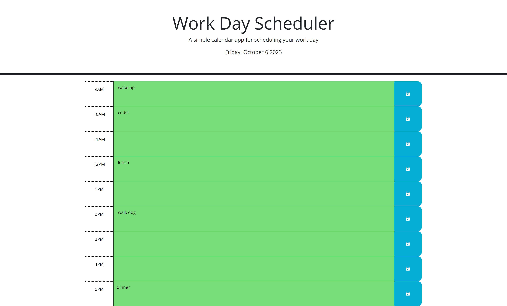

# Work-Day-Scheduler
## Overview

The purpose of this project is to create a simple calendar application that allows a user to save events for each hour of a typical working day (9am–5pm) by modifying starter code. This app will run in the browser and feature dynamically updated HTML and CSS powered by jQuery.
- Add your text to any time block and click the save button
- The corresponding time and text are saved to local storage
- The text is retrieved from local storage so that data persists after the page is refreshed
- The background of each time block is updated automatically based on whether the event is in the past, present or future
- Current date is displayed in the header using Day.js library. Date is updated every 15 minutes

## Work Day Scheduler Application

## Deployment
See it live at: https://alexlenson.github.io/Work-Day-Scheduler/

